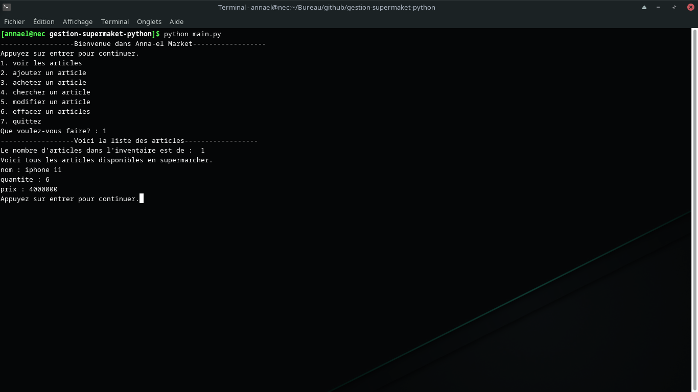

# gestion-supermaket-python

Bonjour et bienvenue dans mon-App, Anna-el Market ...

## About
Ce petit programme en python est gestionnaire de supermarcher en CLI <br>
Il permet :
- Voir les articles enregistres
- Ajouter des articles
- Acheter un article
- Chercher un articles 
- Modifier un article
- Effacer un article

La manipulation d'ajout, Modification et Supresion de ces articles est stockes dans un fichier JSON.

## Authors

- [@Anna-el](https://github.com/Arcan7)


## Tech

- Python
- json 


## Run Locally

Clone the project

```bash
  git clone https://github.com/Arcan7/gestion-supermaket-python.git
```

Go to the project directory

```bash
  cd gestion-supermaket-python
```

Run dependencies

```bash
  python main.py
```


## Screenshots



